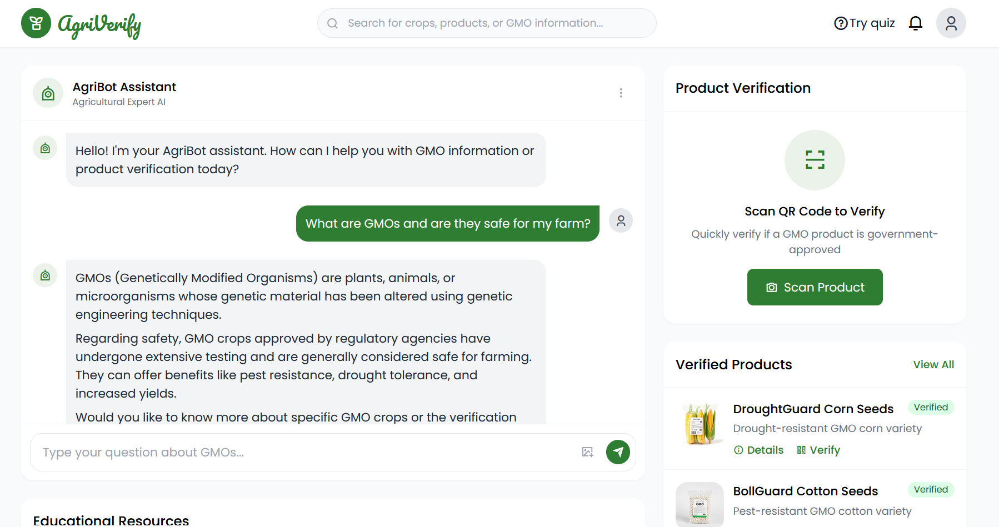

  # 🌱 AgriVerify - GMO Information & Verification Portal

 

AgriVerify is a comprehensive web application designed to provide reliable information and verification services for Genetically Modified Organism (GMO) products in the agricultural sector.

## ✨ Key Features

| Feature | Description | Icon |
|---------|-------------|------|
| **🤖 AI Chatbot** | conversational assistant for GMO queries| 💬 |
| **📱 USSD Access** |Access verification and information via mobile menu (runs on sandbox)| 📞 |
| **🔍 Product Verification** | Scan QR codes, enter verification codes, or upload images to verify GMO products | 📱 |
| **📚 Educational Hub** | Access learning materials, webinars, and expert articles about GMO technology | 🎓 |
| **🧠 Knowledge Quiz** | Interactive assessment tool to test your GMO knowledge | ✅ |
| **📱 Responsive Design** | Fully optimized for both desktop and mobile devices | ✨ |

## 🛠 Technology Stack

### Frontend


### Backend


## 🚧 Development Status

```diff
+ Active Development in Progress
- Some features may be incomplete
! UI/UX improvements ongoing
# Next milestone: v1.0 release
```
Clone the repository:
   ```bash
   git clone
   https://github.com/melau-eddy/Agri-Verify
   ```

## 🤝 Contributing
1. Fork the project
2. Create your feature branch (git checkout -b feature/AmazingFeature)
3. Commit your changes (git commit -m 'Add some AmazingFeature')
4. Push to the branch (git push origin feature/AmazingFeature)
5. Open a Pull Request


